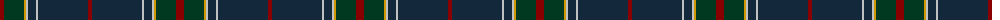

The parent of this is [Raymond of Doune (Corporate)](/tartans/dr/8/dg20/dy2/n2/dn8/n2/dn50/dr/4/)

This was sourced from tartans-authority.  It is a [8 stripes tartan](/stripes/stripes8/).

Original link http://www.tartansauthority.com/tartan-ferret/display/5437/

## Thread count
DR/8 DG20 DY2 N2 DN8 N2 DN50 DR/4

## Palette
Each colour and its ΔE from the base-6 reference it is a variant of.

| Colour | Shade | Base | ΔE (OKLab) |
|---|---|---|---|
| DG |  `#003820` | G  | 0.16 |
| DN |  `#14283C` | B  | 0.14 |
| DR |  `#880000` | R  | 0.14 |
| DY |  `#D09800` | Y  | 0.11 |
| N |  `#C0C0C0` | W  | 0.16 |

# Sample pattern

ID: /variants/dr/8/dg20/dy2/n2/dn8/n2/dn50/dr/4-dg003820-dn14283c-dr880000-dyd09800-nc0c0c0/
