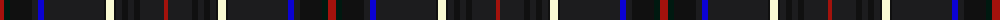

The parent of this is [The Trew 40th](/tartans/dr/8/dg6/k22/ka6/b6/ka60/k2/ly8/k2/ka6/k6/ka6/k6/ka24/dr/4/)

This was sourced from register-of-tartans.  It is a [15 stripes tartan](/stripes/stripes15/).

Original link https://www.tartanregister.gov.uk/tartanDetails.aspx?ref=10033

## Thread count
DR/8 DG6 K22 Ka6 B6 Ka60 K2 LY8 K2 Ka6 K6 Ka6 K6 Ka24 DR/4

## Palette
Each colour and its ΔE from the base-6 reference it is a variant of.

| Colour | Shade | Base | ΔE (OKLab) |
|---|---|---|---|
| B |  `#0B02D3` | B  | 0.15 |
| DG |  `#001910` | K  | 0.19 |
| DR |  `#A3120C` | R  | 0.08 |
| K |  `#101010` | K  | 0.17 |
| Ka |  `#1C1C1E` | B  | 0.20 |
| LY |  `#F9F9D3` | W  | 0.04 |

ID: /variants/dr/8/dg6/k22/ka6/b6/ka60/k2/ly8/k2/ka6/k6/ka6/k6/ka24/dr/4-b0b02d3-dg001910-dra3120c-k101010-ka1c1c1e-lyf9f9d3/
