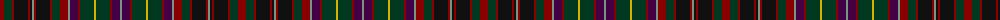

The parent of this is [Gordonstoun #3](/tartans/dr/8/dg8/dr2/k14/dr2/k2/lg2/dr2/k14/dr2/dg8/dr8/lg2/dp8/dr2/dg14/y2/dg14/dr2/dp8/lg/2/)

This was sourced from register-of-tartans.  It is a [21 stripes tartan](/stripes/stripes21/).

Original link https://www.tartanregister.gov.uk/tartanDetails.aspx?ref=1469

## Thread count
DR/8 DG8 DR2 K14 DR2 K2 LG2 DR2 K14 DR2 DG8 DR8 LG2 DP8 DR2 DG14 Y2 DG14 DR2 DP8 LG/2

## Palette
Each colour and its ΔE from the base-6 reference it is a variant of.

| Colour | Shade | Base | ΔE (OKLab) |
|---|---|---|---|
| DG |  `#003820` | G  | 0.16 |
| DP |  `#440044` | B  | 0.17 |
| DR |  `#880000` | R  | 0.14 |
| K |  `#101010` | K  | 0.17 |
| LG |  `#789484` | G  | 0.23 |
| Y |  `#D8B000` | Y  | 0.05 |

ID: /variants/dr/8/dg8/dr2/k14/dr2/k2/lg2/dr2/k14/dr2/dg8/dr8/lg2/dp8/dr2/dg14/y2/dg14/dr2/dp8/lg/2-dg003820-dp440044-dr880000-k101010-lg789484-yd8b000/
