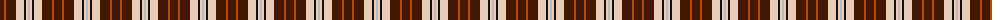
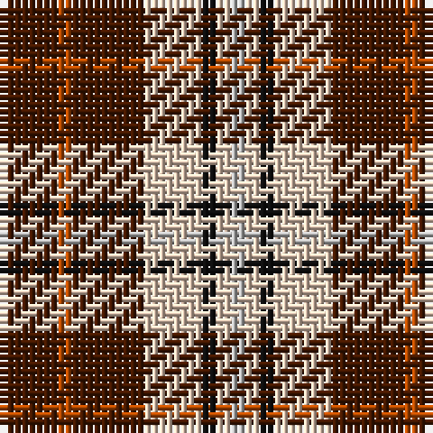

The parent of this is [Elgin](/tartans/dr/8/do2/dr10/lr8/k2/lr2/n/2/)

This was sourced from register-of-tartans.  It is a [7 stripes tartan](/stripes/stripes7/).

Original link https://www.tartanregister.gov.uk/tartanDetails.aspx?ref=1096

## Thread count
DR/8 DO2 DR10 LR8 K2 LR2 N/2

## Palette
Each colour and its ΔE from the base-6 reference it is a variant of.

| Colour | Shade | Base | ΔE (OKLab) |
|---|---|---|---|
| DO |  `#B84C00` | R  | 0.08 |
| DR |  `#441800` | B  | 0.22 |
| K |  `#101010` | K  | 0.17 |
| LR |  `#E8CCB8` | W  | 0.11 |
| N |  `#B8B8B8` | Y  | 0.17 |

# Sample pattern

ID: /variants/dr/8/do2/dr10/lr8/k2/lr2/n/2-dob84c00-dr441800-k101010-lre8ccb8-nb8b8b8/
