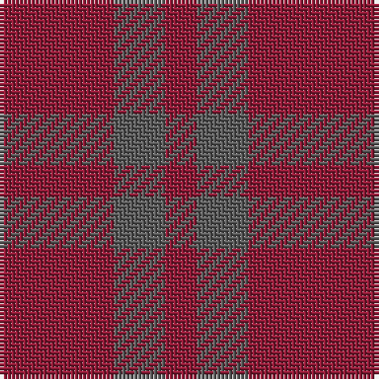

The parent of this is [New Exeter Check (Fashion)](/tartans/dr/8/dr13/dra8/n13/dr/8/)

This was sourced from tartans-authority.  It is a [5 stripes tartan](/stripes/stripes5/).

Original link http://www.tartansauthority.com/tartan-ferret/display/8141/

## Thread count
DR/8 DR13 DRa8 N13 DR/8

## Palette
Each colour and its ΔE from the base-6 reference it is a variant of.

| Colour | Shade | Base | ΔE (OKLab) |
|---|---|---|---|
| DR |  `#901C38` | R  | 0.12 |
| DRa |  `#901C38` | R  | 0.12 |
| N |  `#5C5C5C` | B  | 0.14 |

# Sample pattern

ID: /variants/dr/8/dr13/dra8/n13/dr/8-dr901c38-dra901c38-n5c5c5c/
