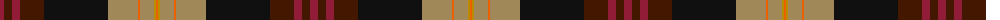

The parent of this is [Hard Rock Cafe (Corporate)](/tartans/dr/8/dra8/dr8/dra24/k64/lt30/o2/lt14/dy2/o/2/)

This was sourced from tartans-authority.  It is a [10 stripes tartan](/stripes/stripes10/).

Original link http://www.tartansauthority.com/tartan-ferret/display/10399/

## Thread count
DR/8 DRa8 DR8 DRa24 K64 LT30 O2 LT14 DY2 O/2

## Palette
Each colour and its ΔE from the base-6 reference it is a variant of.

| Colour | Shade | Base | ΔE (OKLab) |
|---|---|---|---|
| DR |  `#901C38` | R  | 0.12 |
| DRa |  `#441800` | B  | 0.22 |
| DY |  `#BC8C00` | Y  | 0.16 |
| K |  `#101010` | K  | 0.17 |
| LT |  `#A08858` | Y  | 0.21 |
| O |  `#E86000` | R  | 0.14 |

ID: /variants/dr/8/dra8/dr8/dra24/k64/lt30/o2/lt14/dy2/o/2-dr901c38-dra441800-dybc8c00-k101010-lta08858-oe86000/
