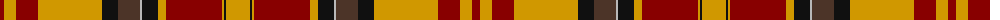

The parent of this is [Aboyne](/tartans/dr/8/dy12/dr22/dy64/k16/t22/n2/k16/dy8/dr56/dy2/k2/dy/24/)

This was sourced from register-of-tartans.  It is a [13 stripes tartan](/stripes/stripes13/).

Original link https://www.tartanregister.gov.uk/tartanDetails.aspx?ref=5170

## Thread count
DR/8 DY12 DR22 DY64 K16 T22 N2 K16 DY8 DR56 DY2 K2 DY/24

## Palette
Each colour and its ΔE from the base-6 reference it is a variant of.

| Colour | Shade | Base | ΔE (OKLab) |
|---|---|---|---|
| DR |  `#880000` | R  | 0.14 |
| DY |  `#D09800` | Y  | 0.11 |
| K |  `#101010` | K  | 0.17 |
| N |  `#B8B8B8` | Y  | 0.17 |
| T |  `#4C3428` | B  | 0.16 |

ID: /variants/dr/8/dy12/dr22/dy64/k16/t22/n2/k16/dy8/dr56/dy2/k2/dy/24-dr880000-dyd09800-k101010-nb8b8b8-t4c3428/
