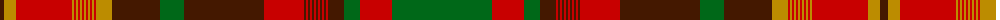

The parent of this is [Newfoundland (CIDD 28098)](/tartans/dr/8/dy12/r56/dy2/r2/dy2/r2/dy2/r2/dy2/r2/dy2/r2/dy2/r2/dy16/dr48/g24/dr80/r40/dr2/r2/dr2/r2/dr2/r2/dr2/r2/dr2/r2/dr2/r2/dr16/g16/r32/g/100/)

This was sourced from register-of-tartans.  It is a [36 stripes tartan](/stripes/stripes36/).

Original link https://www.tartanregister.gov.uk/tartanDetails.aspx?ref=5700

## Thread count
DR/8 DY12 R56 DY2 R2 DY2 R2 DY2 R2 DY2 R2 DY2 R2 DY2 R2 DY16 DR48 G24 DR80 R40 DR2 R2 DR2 R2 DR2 R2 DR2 R2 DR2 R2 DR2 R2 DR16 G16 R32 G/100

## Palette
Each colour and its ΔE from the base-6 reference it is a variant of.

| Colour | Shade | Base | ΔE (OKLab) |
|---|---|---|---|
| DR |  `#441800` | B  | 0.22 |
| DY |  `#BC8C00` | Y  | 0.16 |
| G |  `#006818` | G  | 0.02 |
| R |  `#C80000` | R  | 0.00 |

ID: /variants/dr/8/dy12/r56/dy2/r2/dy2/r2/dy2/r2/dy2/r2/dy2/r2/dy2/r2/dy16/dr48/g24/dr80/r40/dr2/r2/dr2/r2/dr2/r2/dr2/r2/dr2/r2/dr2/r2/dr16/g16/r32/g/100-dr441800-dybc8c00-g006818-rc80000/
