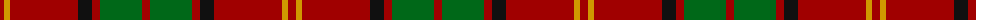

The parent of this is [Kirk (Name)](/tartans/dr/8/dy6/dr68/k14/dr8/g42/dr/8/)

This was sourced from tartans-authority.  It is a [7 stripes tartan](/stripes/stripes7/).

Original link http://www.tartansauthority.com/tartan-ferret/display/4229/

## Thread count
DR/8 DY6 DR68 K14 DR8 G42 DR/8

## Palette
Each colour and its ΔE from the base-6 reference it is a variant of.

| Colour | Shade | Base | ΔE (OKLab) |
|---|---|---|---|
| DR |  `#A00000` | R  | 0.09 |
| DY |  `#D09800` | Y  | 0.11 |
| G |  `#006818` | G  | 0.02 |
| K |  `#101010` | K  | 0.17 |

# Sample pattern

ID: /variants/dr/8/dy6/dr68/k14/dr8/g42/dr/8-dra00000-dyd09800-g006818-k101010/
