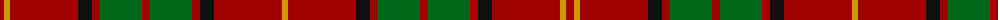

The parent of this is [Kirk](/tartans/dr/8/dy6/dr68/k14/dr8/g42/dr8/g42/dr8/k14/dr68/dy/6/)

This was sourced from register-of-tartans.  It is a [12 stripes tartan](/stripes/stripes12/).

Original link https://www.tartanregister.gov.uk/tartanDetails.aspx?ref=2003

## Thread count
DR/8 DY6 DR68 K14 DR8 G42 DR8 G42 DR8 K14 DR68 DY/6

## Palette
Each colour and its ΔE from the base-6 reference it is a variant of.

| Colour | Shade | Base | ΔE (OKLab) |
|---|---|---|---|
| DG |  `#003820` | G  | 0.16 |
| DR |  `#A00000` | R  | 0.09 |
| DY |  `#D09800` | Y  | 0.11 |
| G |  `#006818` | G  | 0.02 |
| K |  `#101010` | K  | 0.17 |

ID: /variants/dr/8/dy6/dr68/k14/dr8/g42/dr8/g42/dr8/k14/dr68/dy/6-dg003820-dra00000-dyd09800-g006818-k101010/
