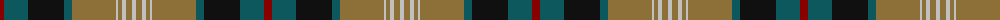

The parent of this is [Windsor](/tartans/dr/8/g24/k36/g8/lt44/n2/lt4/n4/lt6/n/4/)

This was sourced from register-of-tartans.  It is a [10 stripes tartan](/stripes/stripes10/).

Original link https://www.tartanregister.gov.uk/tartanDetails.aspx?ref=4764

## Thread count
DR/8 G24 K36 G8 LT44 N2 LT4 N4 LT6 N/4

## Palette
Each colour and its ΔE from the base-6 reference it is a variant of.

| Colour | Shade | Base | ΔE (OKLab) |
|---|---|---|---|
| DR |  `#880000` | R  | 0.14 |
| G |  `#0C585C` | B  | 0.11 |
| K |  `#101010` | K  | 0.17 |
| LT |  `#8C7038` | G  | 0.18 |
| N |  `#C0C0C0` | W  | 0.16 |

ID: /variants/dr/8/g24/k36/g8/lt44/n2/lt4/n4/lt6/n/4-dr880000-g0c585c-k101010-lt8c7038-nc0c0c0/
