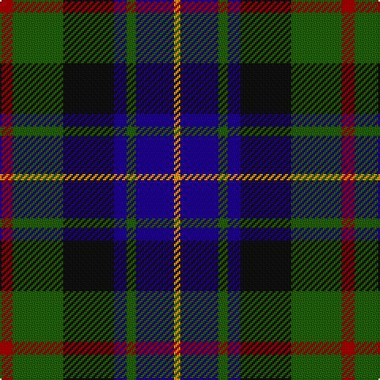

The parent of this is [Junior Chamber International (Corp)](/tartans/dr/8/g32/k32/db8/g6/db24/dy/4/)

This was sourced from tartans-authority.  It is a [7 stripes tartan](/stripes/stripes7/).

Original link http://www.tartansauthority.com/tartan-ferret/display/2331/

## Thread count
DR/8 G32 K32 DB8 G6 DB24 DY/4

## Palette
Each colour and its ΔE from the base-6 reference it is a variant of.

| Colour | Shade | Base | ΔE (OKLab) |
|---|---|---|---|
| DB |  `#1C0070` | B  | 0.14 |
| DR |  `#880000` | R  | 0.14 |
| DY |  `#D09800` | Y  | 0.11 |
| G |  `#285800` | G  | 0.04 |
| K |  `#101010` | K  | 0.17 |

# Sample pattern

ID: /variants/dr/8/g32/k32/db8/g6/db24/dy/4-db1c0070-dr880000-dyd09800-g285800-k101010/
