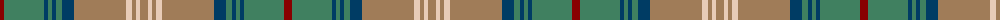

The parent of this is [Dorcas (Fashion)](/tartans/dr/8/g40/db4/g4/db4/g6/db12/lt52/lr6/lt4/lr4/lt/8/)

This was sourced from tartans-authority.  It is a [12 stripes tartan](/stripes/stripes12/).

Original link http://www.tartansauthority.com/tartan-ferret/display/3180/

## Thread count
DR/8 G40 DB4 G4 DB4 G6 DB12 LT52 LR6 LT4 LR4 LT/8

## Palette
Each colour and its ΔE from the base-6 reference it is a variant of.

| Colour | Shade | Base | ΔE (OKLab) |
|---|---|---|---|
| DB |  `#003C64` | B  | 0.07 |
| DR |  `#880000` | R  | 0.14 |
| G |  `#408060` | G  | 0.13 |
| LR |  `#E8CCB8` | W  | 0.11 |
| LT |  `#A07C58` | R  | 0.19 |

ID: /variants/dr/8/g40/db4/g4/db4/g6/db12/lt52/lr6/lt4/lr4/lt/8-db003c64-dr880000-g408060-lre8ccb8-lta07c58/
