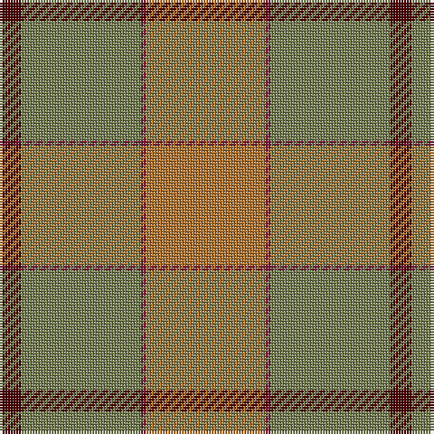

The parent of this is [McWilliams Hunting (2014)](/tartans/dr/8/g44/dra2/lt/44/)

This was sourced from register-of-tartans.  It is a [4 stripes tartan](/stripes/stripes4/).

Original link https://www.tartanregister.gov.uk/tartanDetails.aspx?ref=11134

## Thread count
DR/8 G44 DRa2 LT/44

## Palette
Each colour and its ΔE from the base-6 reference it is a variant of.

| Colour | Shade | Base | ΔE (OKLab) |
|---|---|---|---|
| DR |  `#4C0000` | B  | 0.24 |
| DRa |  `#781C38` | R  | 0.17 |
| G |  `#767E52` | G  | 0.17 |
| LT |  `#B07430` | R  | 0.17 |

# Sample pattern

ID: /variants/dr/8/g44/dra2/lt/44-dr4c0000-dra781c38-g767e52-ltb07430/
