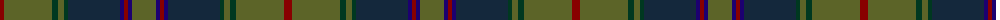

The parent of this is [New South Wales Waratah (District)](/tartans/dr/8/g48/dg6/g6/dg4/dn52/db4/dr4/db4/g/24/)

This was sourced from tartans-authority.  It is a [10 stripes tartan](/stripes/stripes10/).

Original link http://www.tartansauthority.com/tartan-ferret/display/4157/

## Thread count
DR/8 G48 DG6 G6 DG4 DN52 DB4 DR4 DB4 G/24

## Palette
Each colour and its ΔE from the base-6 reference it is a variant of.

| Colour | Shade | Base | ΔE (OKLab) |
|---|---|---|---|
| DB |  `#1C0070` | B  | 0.14 |
| DG |  `#003820` | G  | 0.16 |
| DN |  `#14283C` | B  | 0.14 |
| DR |  `#880000` | R  | 0.14 |
| G |  `#5C6428` | G  | 0.09 |

ID: /variants/dr/8/g48/dg6/g6/dg4/dn52/db4/dr4/db4/g/24-db1c0070-dg003820-dn14283c-dr880000-g5c6428/
