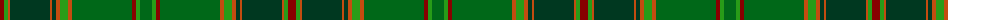

The parent of this is [All Irish Green Irish District Tartan Tartan Number: 4065. Earliest known date: 1997 Part of a collection produced by Lochcarron in 1997 to acknowledge the early historical and cultural links between the Scots and Irish. See products available Copyright © Blair Urquhart, Comrie, 2015](/tartans/dr/8/ga4/do2/dg40/do2/dg4/do4/ga8/do4/g60/dr4/ga4/g/12/)

This was sourced from house-of-tartan.  It is a [13 stripes tartan](/stripes/stripes13/).

Original link http://www.house-of-tartan.scotland.net/house/TartanViewjs.asp?colr=Def&tnam=4065

## Thread count
DR/8 Ga4 DO2 DG40 DO2 DG4 DO4 Ga8 DO4 G60 DR4 Ga4 G/12

## Palette
Each colour and its ΔE from the base-6 reference it is a variant of.

| Colour | Shade | Base | ΔE (OKLab) |
|---|---|---|---|
| DG |  `#003820` | G  | 0.16 |
| DO |  `#C44C10` | R  | 0.08 |
| DR |  `#880000` | R  | 0.14 |
| G |  `#006818` | G  | 0.02 |
| Ga |  `#289C18` | G  | 0.18 |

ID: /variants/dr/8/ga4/do2/dg40/do2/dg4/do4/ga8/do4/g60/dr4/ga4/g/12-dg003820-doc44c10-dr880000-g006818-ga289c18/
