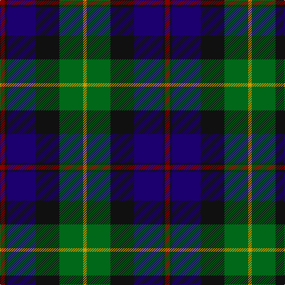

The parent of this is [Loudoun's Highlanders - 1747 #1 (Mil](/tartans/dr/8/k4/db48/k40/g40/dy/6/)

This was sourced from tartans-authority.  It is a [6 stripes tartan](/stripes/stripes6/).

Original link http://www.tartansauthority.com/tartan-ferret/display/5492/

## Thread count
DR/8 K4 DB48 K40 G40 DY/6

## Palette
Each colour and its ΔE from the base-6 reference it is a variant of.

| Colour | Shade | Base | ΔE (OKLab) |
|---|---|---|---|
| DB |  `#1C0070` | B  | 0.14 |
| DR |  `#880000` | R  | 0.14 |
| DY |  `#D09800` | Y  | 0.11 |
| G |  `#006818` | G  | 0.02 |
| K |  `#101010` | K  | 0.17 |

# Sample pattern

ID: /variants/dr/8/k4/db48/k40/g40/dy/6-db1c0070-dr880000-dyd09800-g006818-k101010/
