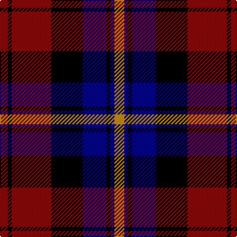

The parent of this is [Aitken](/tartans/dr/8/k4/dr40/k32/db24/k4/db4/dy/10/)

This was sourced from register-of-tartans.  It is a [8 stripes tartan](/stripes/stripes8/).

Original link https://www.tartanregister.gov.uk/tartanDetails.aspx?ref=4891

## Thread count
DR/8 K4 DR40 K32 DB24 K4 DB4 DY/10

## Palette
Each colour and its ΔE from the base-6 reference it is a variant of.

| Colour | Shade | Base | ΔE (OKLab) |
|---|---|---|---|
| DB |  `#00008C` | B  | 0.13 |
| DR |  `#8C0000` | R  | 0.13 |
| DY |  `#C88C00` | Y  | 0.15 |
| K |  `#000000` | K  | 0.00 |

# Sample pattern

ID: /variants/dr/8/k4/dr40/k32/db24/k4/db4/dy/10-db00008c-dr8c0000-dyc88c00-k000000/
