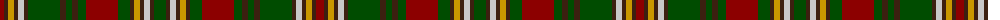

The parent of this is [Mowat, Sir Oliver Commemorative Tartan Tartan Number: 5651. Earliest known date: pre 2002 1820 - 1903. One of the Fathers of the Confederation. Premier of Ontario. See products available Copyright © Blair Urquhart, Comrie, 2015](/tartans/dr/8/k4/dy6/k4/n6/k4/g32/k6/g6/k6/g8/dr32/g12/k4/dy6/k4/n6/k4/g/12/)

This was sourced from house-of-tartan.  It is a [19 stripes tartan](/stripes/stripes19/).

Original link http://www.house-of-tartan.scotland.net/house/TartanViewjs.asp?colr=Def&tnam=5651

## Thread count
DR/8 K4 DY6 K4 N6 K4 G32 K6 G6 K6 G8 DR32 G12 K4 DY6 K4 N6 K4 G/12

## Palette
Each colour and its ΔE from the base-6 reference it is a variant of.

| Colour | Shade | Base | ΔE (OKLab) |
|---|---|---|---|
| DR |  `#8C0000` | R  | 0.13 |
| DY |  `#C89800` | Y  | 0.12 |
| G |  `#004C00` | G  | 0.08 |
| K |  `#3C2010` | B  | 0.20 |
| N |  `#C8C8C8` | W  | 0.13 |

ID: /variants/dr/8/k4/dy6/k4/n6/k4/g32/k6/g6/k6/g8/dr32/g12/k4/dy6/k4/n6/k4/g/12-dr8c0000-dyc89800-g004c00-k3c2010-nc8c8c8/
