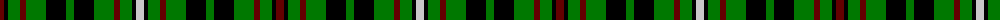

The parent of this is [Crihfield Family (Personal)](/tartans/dr/8/k4/g12/dr6/g20/k20/g8/k20/g20/dr6/g12/k4/n/8/)

This was sourced from tartans-authority.  It is a [13 stripes tartan](/stripes/stripes13/).

Original link http://www.tartansauthority.com/tartan-ferret/display/4614/

## Thread count
DR/8 K4 G12 DR6 G20 K20 G8 K20 G20 DR6 G12 K4 N/8

## Palette
Each colour and its ΔE from the base-6 reference it is a variant of.

| Colour | Shade | Base | ΔE (OKLab) |
|---|---|---|---|
| DR |  `#640000` | R  | 0.22 |
| G |  `#007800` | G  | 0.06 |
| K |  `#000000` | K  | 0.00 |
| N |  `#C8C8C8` | W  | 0.13 |

ID: /variants/dr/8/k4/g12/dr6/g20/k20/g8/k20/g20/dr6/g12/k4/n/8-dr640000-g007800-k000000-nc8c8c8/
