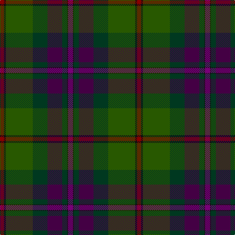

The parent of this is [Batten of Argyll (Baddenach)](/tartans/dr/8/k4/g55/dg30/dp30/dg10/k2/p/10/)

This was sourced from register-of-tartans.  It is a [8 stripes tartan](/stripes/stripes8/).

Original link https://www.tartanregister.gov.uk/tartanDetails.aspx?ref=229

## Thread count
DR/8 K4 G55 DG30 DP30 DG10 K2 P/10

## Palette
Each colour and its ΔE from the base-6 reference it is a variant of.

| Colour | Shade | Base | ΔE (OKLab) |
|---|---|---|---|
| DG |  `#003820` | G  | 0.16 |
| DP |  `#440044` | B  | 0.17 |
| DR |  `#880000` | R  | 0.14 |
| G |  `#285800` | G  | 0.04 |
| K |  `#101010` | K  | 0.17 |
| LP |  `#9C68A4` | R  | 0.21 |
| P |  `#780078` | B  | 0.16 |
| Pa |  `#9058D8` | B  | 0.22 |
| R |  `#C80000` | R  | 0.00 |

# Sample pattern

ID: /variants/dr/8/k4/g55/dg30/dp30/dg10/k2/p/10-dg003820-dp440044-dr880000-g285800-k101010-lp9c68a4-p780078-pa9058d8-rc80000/
