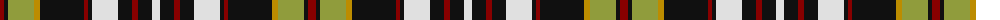

The parent of this is [Tyrone County Crest (Fashion)](/tartans/dr/8/k4/lt26/dy6/k44/dr4/k4/ln26/k14/dr6/k14/ln/8/)

This was sourced from tartans-authority.  It is a [12 stripes tartan](/stripes/stripes12/).

Original link http://www.tartansauthority.com/tartan-ferret/display/7457/

## Thread count
DR/8 K4 LT26 DY6 K44 DR4 K4 LN26 K14 DR6 K14 LN/8

## Palette
Each colour and its ΔE from the base-6 reference it is a variant of.

| Colour | Shade | Base | ΔE (OKLab) |
|---|---|---|---|
| DR |  `#880000` | R  | 0.14 |
| DY |  `#BC8C00` | Y  | 0.16 |
| K |  `#101010` | K  | 0.17 |
| LN |  `#E0E0E0` | W  | 0.06 |
| LT |  `#909C3C` | Y  | 0.17 |

ID: /variants/dr/8/k4/lt26/dy6/k44/dr4/k4/ln26/k14/dr6/k14/ln/8-dr880000-dybc8c00-k101010-lne0e0e0-lt909c3c/
