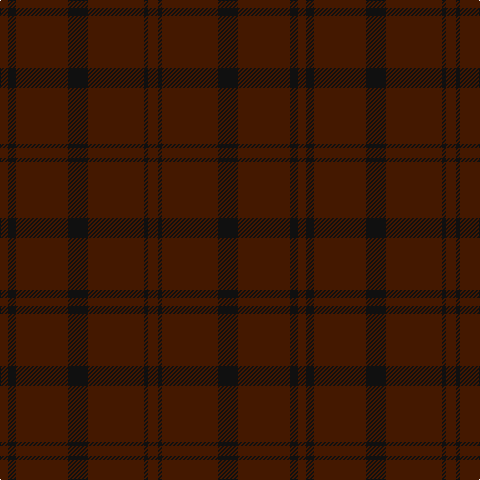

The parent of this is [Dunbar, John Telfer (Personal)](/tartans/dr/8/k8/dr52/k20/dr56/k4/dr/10/)

This was sourced from register-of-tartans.  It is a [7 stripes tartan](/stripes/stripes7/).

Original link https://www.tartanregister.gov.uk/tartanDetails.aspx?ref=1020

## Thread count
DR/8 K8 DR52 K20 DR56 K4 DR/10

## Palette
Each colour and its ΔE from the base-6 reference it is a variant of.

| Colour | Shade | Base | ΔE (OKLab) |
|---|---|---|---|
| DR |  `#441800` | B  | 0.22 |
| K |  `#101010` | K  | 0.17 |

# Sample pattern

ID: /variants/dr/8/k8/dr52/k20/dr56/k4/dr/10-dr441800-k101010/
