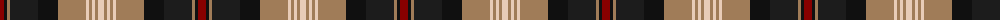

The parent of this is [Logan #6](/tartans/dr/8/ka3/lt3/k28/ka20/lt28/lr3/lt3/lr3/lt3/lr/6/)

This was sourced from register-of-tartans.  It is a [11 stripes tartan](/stripes/stripes11/).

Original link https://www.tartanregister.gov.uk/tartanDetails.aspx?ref=2186

## Thread count
DR/8 Ka3 LT3 K28 Ka20 LT28 LR3 LT3 LR3 LT3 LR/6

## Palette
Each colour and its ΔE from the base-6 reference it is a variant of.

| Colour | Shade | Base | ΔE (OKLab) |
|---|---|---|---|
| DR |  `#880000` | R  | 0.14 |
| K |  `#1C1C1C` | B  | 0.20 |
| Ka |  `#101010` | K  | 0.17 |
| LR |  `#E8CCB8` | W  | 0.11 |
| LT |  `#A07C58` | R  | 0.19 |

ID: /variants/dr/8/ka3/lt3/k28/ka20/lt28/lr3/lt3/lr3/lt3/lr/6-dr880000-k1c1c1c-ka101010-lre8ccb8-lta07c58/
