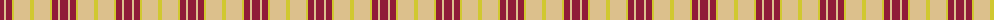
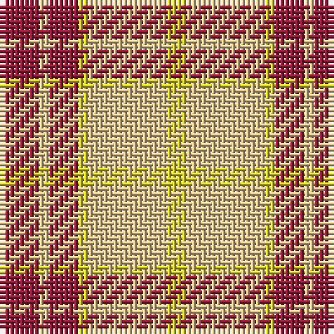

The parent of this is [Buchele Check (Fashion?)](/tartans/dr/8/lg2/dr6/y2/lg16/y/4/)

This was sourced from tartans-authority.  It is a [6 stripes tartan](/stripes/stripes6/).

Original link http://www.tartansauthority.com/tartan-ferret/display/8124/

## Thread count
DR/8 LG2 DR6 Y2 LG16 Y/4

## Palette
Each colour and its ΔE from the base-6 reference it is a variant of.

| Colour | Shade | Base | ΔE (OKLab) |
|---|---|---|---|
| DR |  `#901C38` | R  | 0.12 |
| LG |  `#DCC08C` | Y  | 0.10 |
| Y |  `#D0C830` | Y  | 0.04 |

# Sample pattern

ID: /variants/dr/8/lg2/dr6/y2/lg16/y/4-dr901c38-lgdcc08c-yd0c830/
