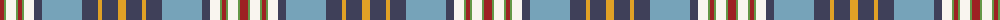

The parent of this is [Pille Family (Belgium) (Personal)](/tartans/dr/8/lg2/w10/lg2/dr4/lg2/w10/n8/b40/n16/y4/n16/y/8/)

This was sourced from register-of-tartans.  It is a [13 stripes tartan](/stripes/stripes13/).

Original link https://www.tartanregister.gov.uk/tartanDetails.aspx?ref=10345

## Thread count
DR/8 LG2 W10 LG2 DR4 LG2 W10 N8 B40 N16 Y4 N16 Y/8

## Palette
Each colour and its ΔE from the base-6 reference it is a variant of.

| Colour | Shade | Base | ΔE (OKLab) |
|---|---|---|---|
| B |  `#76A3B9` | Y  | 0.25 |
| DR |  `#9D2123` | R  | 0.09 |
| LG |  `#649848` | G  | 0.19 |
| N |  `#3F4059` | B  | 0.08 |
| W |  `#F9F5EF` | W  | 0.01 |
| Y |  `#E0A126` | Y  | 0.08 |

ID: /variants/dr/8/lg2/w10/lg2/dr4/lg2/w10/n8/b40/n16/y4/n16/y/8-b76a3b9-dr9d2123-lg649848-n3f4059-wf9f5ef-ye0a126/
