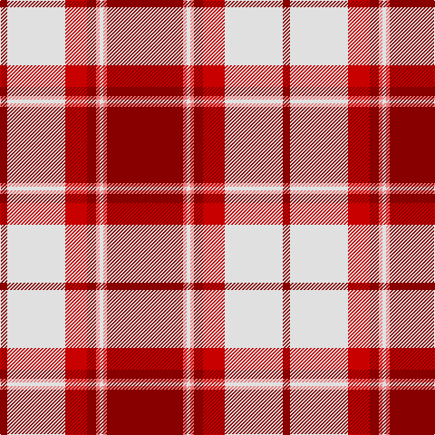

The parent of this is [Longniddry, Burgundy (Dance)](/tartans/dr/8/ln64/r24/dr10/lr4/ln4/lr4/dr/84/)

This was sourced from tartans-authority.  It is a [8 stripes tartan](/stripes/stripes8/).

Original link http://www.tartansauthority.com/tartan-ferret/display/1651/

## Thread count
DR/8 LN64 R24 DR10 LR4 LN4 LR4 DR/84

## Palette
Each colour and its ΔE from the base-6 reference it is a variant of.

| Colour | Shade | Base | ΔE (OKLab) |
|---|---|---|---|
| DR |  `#880000` | R  | 0.14 |
| LN |  `#E0E0E0` | W  | 0.06 |
| LR |  `#E87878` | R  | 0.19 |
| R |  `#C80000` | R  | 0.00 |

# Sample pattern

ID: /variants/dr/8/ln64/r24/dr10/lr4/ln4/lr4/dr/84-dr880000-lne0e0e0-lre87878-rc80000/
