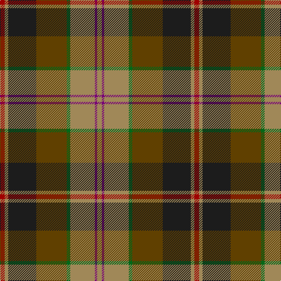

The parent of this is [Goddin mab Gododdin (Personal)](/tartans/dr/8/lt6/k48/t52/g6/lt42/p4/lt/8/)

This was sourced from tartans-authority.  It is a [8 stripes tartan](/stripes/stripes8/).

Original link http://www.tartansauthority.com/tartan-ferret/display/7179/

## Thread count
DR/8 LT6 K48 T52 G6 LT42 P4 LT/8

## Palette
Each colour and its ΔE from the base-6 reference it is a variant of.

| Colour | Shade | Base | ΔE (OKLab) |
|---|---|---|---|
| DR |  `#A00000` | R  | 0.09 |
| G |  `#006818` | G  | 0.02 |
| K |  `#1C1C1C` | B  | 0.20 |
| LT |  `#A08858` | Y  | 0.21 |
| P |  `#780078` | B  | 0.16 |
| T |  `#604000` | G  | 0.14 |

# Sample pattern

ID: /variants/dr/8/lt6/k48/t52/g6/lt42/p4/lt/8-dra00000-g006818-k1c1c1c-lta08858-p780078-t604000/
