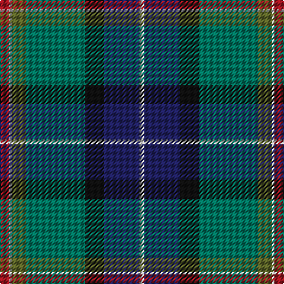

The parent of this is [Jones Personal Tartan Tartan Number: 2476. Earliest known date: 1997 Designed by Peter MacDonald for Mrs Ros Jones, Aros, Isle of Mull and intended for all of the name Jones. Produced to raise money for National and International Charities. Registered Design Number :- 602573 See products available Copyright © Blair Urquhart, Comrie, 2015](/tartans/dr/8/n2/g12/ga50/k16/db30/n/4/)

This was sourced from house-of-tartan.  It is a [7 stripes tartan](/stripes/stripes7/).

Original link http://www.house-of-tartan.scotland.net/house/TartanViewjs.asp?colr=Def&tnam=2476

## Thread count
DR/8 N2 G12 Ga50 K16 DB30 N/4

## Palette
Each colour and its ΔE from the base-6 reference it is a variant of.

| Colour | Shade | Base | ΔE (OKLab) |
|---|---|---|---|
| DB |  `#202060` | B  | 0.11 |
| DG |  `#003820` | G  | 0.16 |
| DR |  `#A01420` | R  | 0.08 |
| G |  `#5C6428` | G  | 0.09 |
| Ga |  `#007460` | G  | 0.11 |
| K |  `#101010` | K  | 0.17 |
| N |  `#C0C0C0` | W  | 0.16 |

# Sample pattern

ID: /variants/dr/8/n2/g12/ga50/k16/db30/n/4-db202060-dg003820-dra01420-g5c6428-ga007460-k101010-nc0c0c0/
