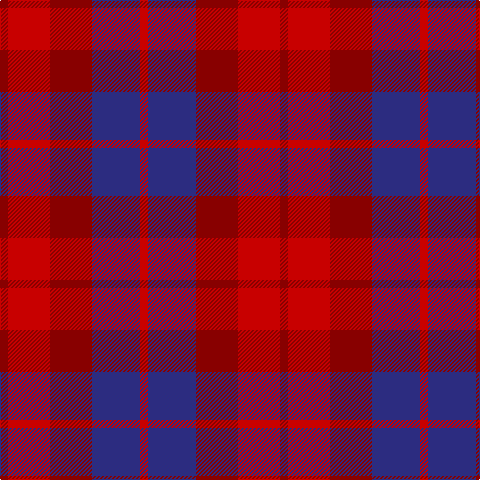

The parent of this is [Ferguson Britt Red (Corporate)](/tartans/dr/8/r42/dr42/db48/r/8/)

This was sourced from tartans-authority.  It is a [5 stripes tartan](/stripes/stripes5/).

Original link http://www.tartansauthority.com/tartan-ferret/display/8122/

## Thread count
DR/8 R42 DR42 DB48 R/8

## Palette
Each colour and its ΔE from the base-6 reference it is a variant of.

| Colour | Shade | Base | ΔE (OKLab) |
|---|---|---|---|
| DB |  `#2C2C80` | B  | 0.05 |
| DR |  `#880000` | R  | 0.14 |
| R |  `#C80000` | R  | 0.00 |

# Sample pattern

ID: /variants/dr/8/r42/dr42/db48/r/8-db2c2c80-dr880000-rc80000/
