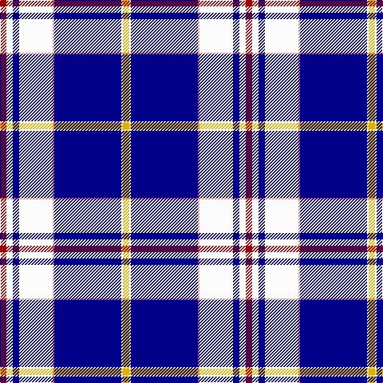

The parent of this is [Presley of Memphis (Fashion)](/tartans/dr/8/w8/db8/w42/lr2/db84/w2/y/8/)

This was sourced from tartans-authority.  It is a [8 stripes tartan](/stripes/stripes8/).

Original link http://www.tartansauthority.com/tartan-ferret/display/6237/

## Thread count
DR/8 W8 DB8 W42 LR2 DB84 W2 Y/8

## Palette
Each colour and its ΔE from the base-6 reference it is a variant of.

| Colour | Shade | Base | ΔE (OKLab) |
|---|---|---|---|
| DB |  `#000088` | B  | 0.14 |
| DR |  `#A00000` | R  | 0.09 |
| LR |  `#E87878` | R  | 0.19 |
| W |  `#FCFCFC` | W  | 0.03 |
| Y |  `#E0B000` | Y  | 0.04 |

# Sample pattern

ID: /variants/dr/8/w8/db8/w42/lr2/db84/w2/y/8-db000088-dra00000-lre87878-wfcfcfc-ye0b000/
