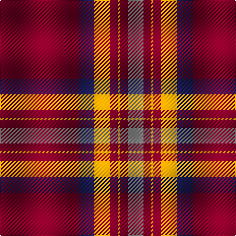

The parent of this is [Wcwm 4907-1](/tartans/dr/80/db16/dy16/dr8/dy2/dr8/n/16/)

This was sourced from register-of-tartans.  It is a [7 stripes tartan](/stripes/stripes7/).

Original link https://www.tartanregister.gov.uk/tartanDetails.aspx?ref=4549

## Thread count
DR/80 DB16 DY16 DR8 DY2 DR8 N/16

## Palette
Each colour and its ΔE from the base-6 reference it is a variant of.

| Colour | Shade | Base | ΔE (OKLab) |
|---|---|---|---|
| DB |  `#202060` | B  | 0.11 |
| DR |  `#800028` | R  | 0.16 |
| DY |  `#D09800` | Y  | 0.11 |
| N |  `#B8B8B8` | Y  | 0.17 |

# Sample pattern

ID: /variants/dr/80/db16/dy16/dr8/dy2/dr8/n/16-db202060-dr800028-dyd09800-nb8b8b8/
