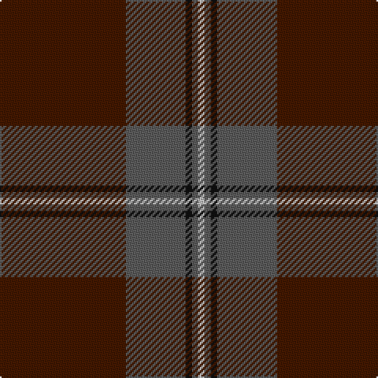

The parent of this is [National Ballet of Canada](/tartans/dr/80/n38/k4/n4/na/4/)

This was sourced from register-of-tartans.  It is a [5 stripes tartan](/stripes/stripes5/).

Original link https://www.tartanregister.gov.uk/tartanDetails.aspx?ref=3096

## Thread count
DR/80 N38 K4 N4 Na/4

## Palette
Each colour and its ΔE from the base-6 reference it is a variant of.

| Colour | Shade | Base | ΔE (OKLab) |
|---|---|---|---|
| DR |  `#441800` | B  | 0.22 |
| K |  `#101010` | K  | 0.17 |
| N |  `#5C5C5C` | B  | 0.14 |
| Na |  `#C0C0C0` | W  | 0.16 |

# Sample pattern

ID: /variants/dr/80/n38/k4/n4/na/4-dr441800-k101010-n5c5c5c-nac0c0c0/
