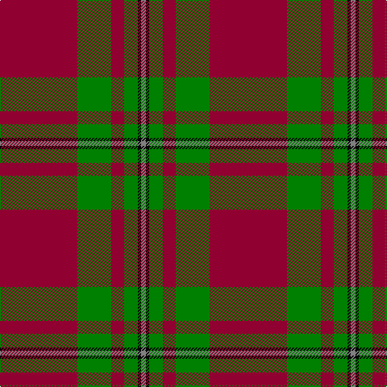

The parent of this is [MacGregor, Glengyle](/tartans/dr/96/g42/dr16/g17/k4/n/6/)

This was sourced from weddslist.  It is a [6 stripes tartan](/stripes/stripes6/).

Original link http://www.weddslist.com/cgi-bin/tartans/pg.pl?source=sts

## Thread count
DR/96 G42 DR16 G17 K4 N/6

## Palette
Each colour and its ΔE from the base-6 reference it is a variant of.

| Colour | Shade | Base | ΔE (OKLab) |
|---|---|---|---|
| DR |  `#900030` | R  | 0.13 |
| G |  `#008000` | G  | 0.09 |
| K |  `#000000` | K  | 0.00 |
| N |  `#808080` | G  | 0.22 |

# Sample pattern

ID: /variants/dr/96/g42/dr16/g17/k4/n/6-dr900030-g008000-k000000-n808080/
