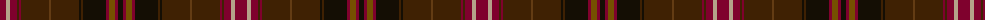

The parent of this is [Scottish Register of Tartans' Tartan](/tartans/dra/12/n4/dra7/dr2/dra2/dr28/t2/dr28/k2/dr2/k23/dra3/ta6/dra3/k/5/)

This was sourced from register-of-tartans.  It is a [15 stripes tartan](/stripes/stripes15/).

Original link https://www.tartanregister.gov.uk/tartanDetails.aspx?ref=10000

## Thread count
DRa/12 N4 DRa7 DR2 DRa2 DR28 T2 DR28 K2 DR2 K23 DRa3 Ta6 DRa3 K/5

## Palette
Each colour and its ΔE from the base-6 reference it is a variant of.

| Colour | Shade | Base | ΔE (OKLab) |
|---|---|---|---|
| DR |  `#3F2103` | B  | 0.21 |
| DRa |  `#7F012D` | R  | 0.16 |
| K |  `#140E04` | K  | 0.17 |
| N |  `#B5A189` | Y  | 0.16 |
| T |  `#633C14` | G  | 0.16 |
| Ta |  `#755000` | G  | 0.14 |

ID: /variants/dra/12/n4/dra7/dr2/dra2/dr28/t2/dr28/k2/dr2/k23/dra3/ta6/dra3/k/5-dr3f2103-dra7f012d-k140e04-nb5a189-t633c14-ta755000/
