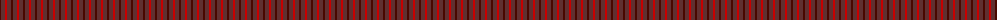
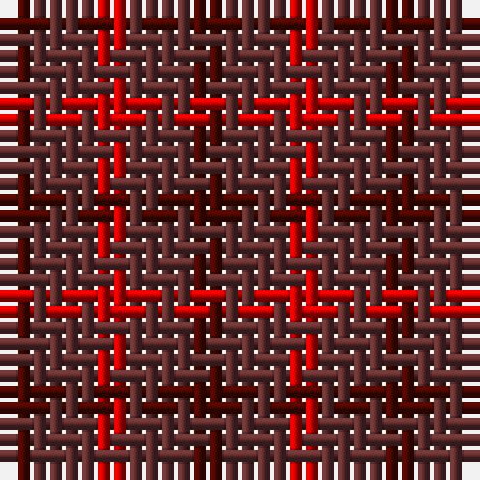

The parent of this is [Glenmorangie Check Corporate Tartan Tartan Number: 1663. Earliest known date: 1988 Accredited by the Scottish Tartans Society in 1988. Glenmorangie is a well known malt whisky. See products available Copyright © Blair Urquhart, Comrie, 2015](/tartans/dra/2/dr4/r/2/)

This was sourced from house-of-tartan.  It is a [3 stripes tartan](/stripes/stripes3/).

Original link http://www.house-of-tartan.scotland.net/house/TartanViewjs.asp?colr=Def&tnam=1663

## Thread count
DRa/2 DR4 R/2

## Palette
Each colour and its ΔE from the base-6 reference it is a variant of.

| Colour | Shade | Base | ΔE (OKLab) |
|---|---|---|---|
| DR |  `#603030` | B  | 0.16 |
| DRa |  `#480800` | B  | 0.23 |
| R |  `#C80000` | R  | 0.00 |

# Sample pattern

ID: /variants/dra/2/dr4/r/2-dr603030-dra480800-rc80000/
