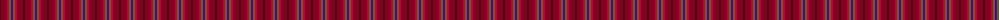
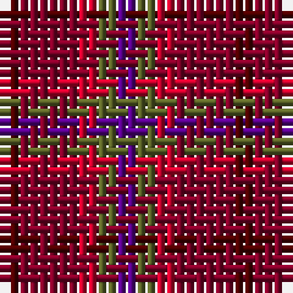

The parent of this is [Blairgowrie Berries and Cherries](/tartans/dra/2/dr6/r2/g2/p/2/)

This was sourced from register-of-tartans.  It is a [5 stripes tartan](/stripes/stripes5/).

Original link https://www.tartanregister.gov.uk/tartanDetails.aspx?ref=11150

## Thread count
DRa/2 DR6 R2 G2 P/2

## Palette
Each colour and its ΔE from the base-6 reference it is a variant of.

| Colour | Shade | Base | ΔE (OKLab) |
|---|---|---|---|
| DR |  `#800028` | R  | 0.16 |
| DRa |  `#4C0000` | B  | 0.24 |
| G |  `#5C6428` | G  | 0.09 |
| P |  `#5A008C` | B  | 0.12 |
| R |  `#C8002C` | R  | 0.03 |

# Sample pattern

ID: /variants/dra/2/dr6/r2/g2/p/2-dr800028-dra4c0000-g5c6428-p5a008c-rc8002c/
