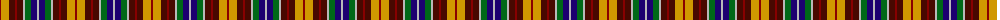

The parent of this is [Arran, Isle of (Fashion)](/tartans/dra/2/dy8/dr6/dra2/dr6/n2/g6/db6/n/2/)

This was sourced from tartans-authority.  It is a [9 stripes tartan](/stripes/stripes9/).

Original link http://www.tartansauthority.com/tartan-ferret/display/5281/

## Thread count
DRa/2 DY8 DR6 DRa2 DR6 N2 G6 DB6 N/2

## Palette
Each colour and its ΔE from the base-6 reference it is a variant of.

| Colour | Shade | Base | ΔE (OKLab) |
|---|---|---|---|
| DB |  `#1C0070` | B  | 0.14 |
| DR |  `#480800` | B  | 0.23 |
| DRa |  `#880000` | R  | 0.14 |
| DY |  `#D09800` | Y  | 0.11 |
| G |  `#006818` | G  | 0.02 |
| N |  `#B8B8B8` | Y  | 0.17 |

ID: /variants/dra/2/dy8/dr6/dra2/dr6/n2/g6/db6/n/2-db1c0070-dr480800-dra880000-dyd09800-g006818-nb8b8b8/
