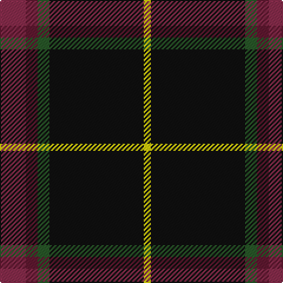

The parent of this is [MacShimsi Personal Tartan Tartan Number: 7318. Earliest known date: 2007 Designed for the MacShimsi Clan in Dundee See products available Copyright © Blair Urquhart, Comrie, 2015](/tartans/dra/22/dr10/g10/k80/y/6/)

This was sourced from house-of-tartan.  It is a [5 stripes tartan](/stripes/stripes5/).

Original link http://www.house-of-tartan.scotland.net/house/TartanViewjs.asp?colr=Def&tnam=7318

## Thread count
DRa/22 DR10 G10 K80 Y/6

## Palette
Each colour and its ΔE from the base-6 reference it is a variant of.

| Colour | Shade | Base | ΔE (OKLab) |
|---|---|---|---|
| DR |  `#601830` | B  | 0.18 |
| DRa |  `#882C4C` | R  | 0.14 |
| G |  `#285828` | G  | 0.06 |
| K |  `#101010` | K  | 0.17 |
| Y |  `#DCD00C` | Y  | 0.04 |

# Sample pattern

ID: /variants/dra/22/dr10/g10/k80/y/6-dr601830-dra882c4c-g285828-k101010-ydcd00c/
