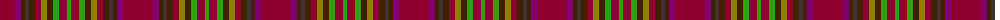

The parent of this is [Unidentified, chair covering](/tartans/dra/30/p6/dr4/t4/dr6/dra6/lg6/dr6/g6/dra8/g/4/)

This was sourced from weddslist.  It is a [11 stripes tartan](/stripes/stripes11/).

Original link http://www.weddslist.com/cgi-bin/tartans/pg.pl?source=sts

## Thread count
DRa/30 P6 DR4 T4 DR6 DRa6 LG6 DR6 G6 DRa8 G/4

## Palette
Each colour and its ΔE from the base-6 reference it is a variant of.

| Colour | Shade | Base | ΔE (OKLab) |
|---|---|---|---|
| DR |  `#402000` | B  | 0.21 |
| DRa |  `#900030` | R  | 0.13 |
| G |  `#30A010` | G  | 0.19 |
| LG |  `#908000` | G  | 0.19 |
| P |  `#800070` | B  | 0.17 |
| T |  `#403030` | B  | 0.14 |

ID: /variants/dra/30/p6/dr4/t4/dr6/dra6/lg6/dr6/g6/dra8/g/4-dr402000-dra900030-g30a010-lg908000-p800070-t403030/
