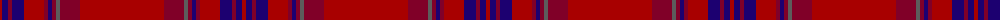

The parent of this is [Kirtle (Fashion)](/tartans/dra/4/db6/dr4/db12/dra20/dr4/db4/dr4/n4/dr20/dra/84/)

This was sourced from tartans-authority.  It is a [11 stripes tartan](/stripes/stripes11/).

Original link http://www.tartansauthority.com/tartan-ferret/display/5369/

## Thread count
DRa/4 DB6 DR4 DB12 DRa20 DR4 DB4 DR4 N4 DR20 DRa/84

## Palette
Each colour and its ΔE from the base-6 reference it is a variant of.

| Colour | Shade | Base | ΔE (OKLab) |
|---|---|---|---|
| DB |  `#1C0070` | B  | 0.14 |
| DR |  `#800028` | R  | 0.16 |
| DRa |  `#A80000` | R  | 0.07 |
| N |  `#5C5C5C` | B  | 0.14 |

ID: /variants/dra/4/db6/dr4/db12/dra20/dr4/db4/dr4/n4/dr20/dra/84-db1c0070-dr800028-draa80000-n5c5c5c/
