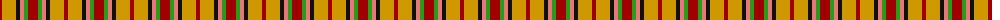
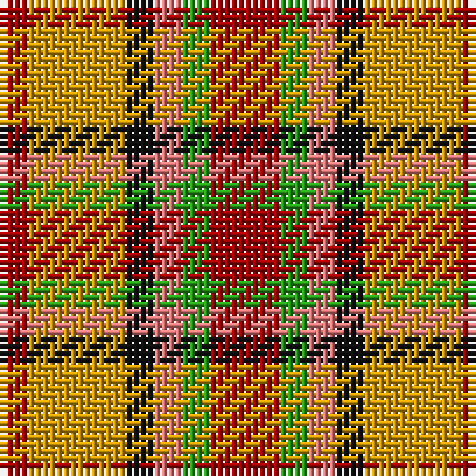

The parent of this is [Victoria, City of (British Columbia)](/tartans/dra/4/dy14/k4/lr4/g4/dra/10/)

This was sourced from register-of-tartans.  It is a [6 stripes tartan](/stripes/stripes6/).

Original link https://www.tartanregister.gov.uk/tartanDetails.aspx?ref=4458

## Thread count
DRa/4 DY14 K4 LR4 G4 DRa/10

## Palette
Each colour and its ΔE from the base-6 reference it is a variant of.

| Colour | Shade | Base | ΔE (OKLab) |
|---|---|---|---|
| DR |  `#880000` | R  | 0.14 |
| DRa |  `#A00000` | R  | 0.09 |
| DY |  `#D09800` | Y  | 0.11 |
| G |  `#289C18` | G  | 0.18 |
| K |  `#101010` | K  | 0.17 |
| LR |  `#E87878` | R  | 0.19 |
| R |  `#C80000` | R  | 0.00 |

# Sample pattern

ID: /variants/dra/4/dy14/k4/lr4/g4/dra/10-dr880000-draa00000-dyd09800-g289c18-k101010-lre87878-rc80000/
