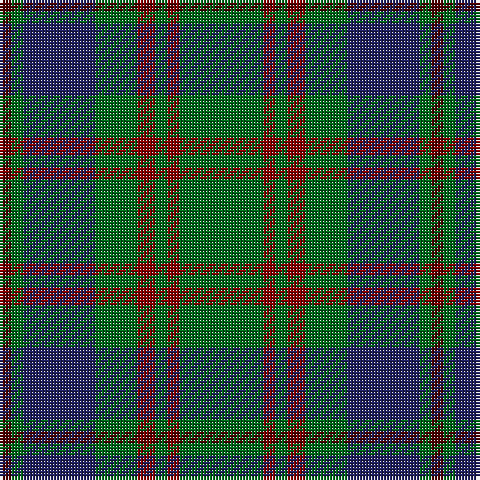

The parent of this is [Glen Nevis #3](/tartans/dra/4/g4/db24/g14/dr6/g4/dr4/g/28/)

This was sourced from register-of-tartans.  It is a [8 stripes tartan](/stripes/stripes8/).

Original link https://www.tartanregister.gov.uk/tartanDetails.aspx?ref=1391

## Thread count
DRa/4 G4 DB24 G14 DR6 G4 DR4 G/28

## Palette
Each colour and its ΔE from the base-6 reference it is a variant of.

| Colour | Shade | Base | ΔE (OKLab) |
|---|---|---|---|
| DB |  `#202060` | B  | 0.11 |
| DR |  `#880000` | R  | 0.14 |
| DRa |  `#4C0000` | B  | 0.24 |
| G |  `#006818` | G  | 0.02 |

# Sample pattern

ID: /variants/dra/4/g4/db24/g14/dr6/g4/dr4/g/28-db202060-dr880000-dra4c0000-g006818/
