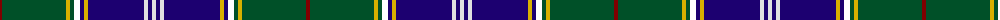

The parent of this is [Pringle Personal Tartan Tartan Number: 5447. Earliest known date: c.1998 Dalgleish of Selkirk designed and wove this circa 1998 as a personal tartan for someone of the name, Pringle. See products available Copyright © Blair Urquhart, Comrie, 2015](/tartans/dra/4/g64/y4/g4/k6/dba4/y4/dba56/ln4/dba4/ln/4/)

This was sourced from house-of-tartan.  It is a [11 stripes tartan](/stripes/stripes11/).

Original link http://www.house-of-tartan.scotland.net/house/TartanViewjs.asp?colr=Def&tnam=5447

## Thread count
DRa/4 G64 Y4 G4 K6 DBa4 Y4 DBa56 LN4 DBa4 LN/4

## Palette
Each colour and its ΔE from the base-6 reference it is a variant of.

| Colour | Shade | Base | ΔE (OKLab) |
|---|---|---|---|
| DB |  `#003C64` | B  | 0.07 |
| DBa |  `#1C0070` | B  | 0.14 |
| DR |  `#441800` | B  | 0.22 |
| DRa |  `#800000` | R  | 0.16 |
| G |  `#005028` | G  | 0.08 |
| LN |  `#E0E0E0` | W  | 0.06 |
| LNa |  `#D8D8D8` | W  | 0.08 |
| Y |  `#D8B000` | Y  | 0.05 |

ID: /variants/dra/4/g64/y4/g4/k6/dba4/y4/dba56/ln4/dba4/ln/4-db003c64-dba1c0070-dr441800-dra800000-g005028-lne0e0e0-lnad8d8d8-yd8b000/
