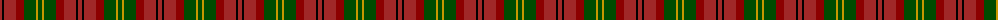
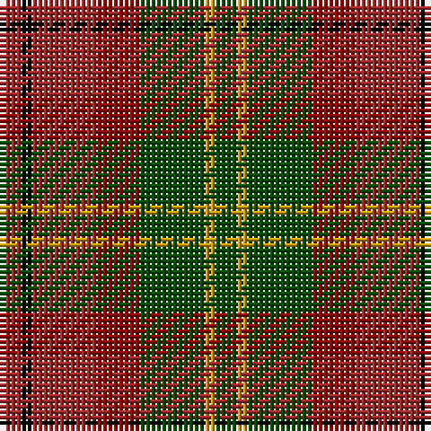

The parent of this is [Unidentified Printing #3](/tartans/dra/4/k2/dra12/dr8/g12/dy2/g/4/)

This was sourced from register-of-tartans.  It is a [7 stripes tartan](/stripes/stripes7/).

Original link https://www.tartanregister.gov.uk/tartanDetails.aspx?ref=4361

## Thread count
DRa/4 K2 DRa12 DR8 G12 DY2 G/4

## Palette
Each colour and its ΔE from the base-6 reference it is a variant of.

| Colour | Shade | Base | ΔE (OKLab) |
|---|---|---|---|
| DR |  `#8C0000` | R  | 0.13 |
| DRa |  `#A02828` | R  | 0.08 |
| DY |  `#C89800` | Y  | 0.12 |
| G |  `#004C00` | G  | 0.08 |
| K |  `#000000` | K  | 0.00 |

# Sample pattern

ID: /variants/dra/4/k2/dra12/dr8/g12/dy2/g/4-dr8c0000-draa02828-dyc89800-g004c00-k000000/
