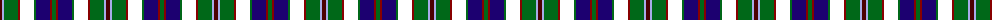

The parent of this is [MacCraig](/tartans/dra/4/lp2/g14/dr2/k14/g2/db14/dr2/g/4/)

This was sourced from register-of-tartans.  It is a [9 stripes tartan](/stripes/stripes9/).

Original link https://www.tartanregister.gov.uk/tartanDetails.aspx?ref=5171

## Thread count
DRa/4 LP2 G14 DR2 K14 G2 DB14 DR2 G/4

## Palette
Each colour and its ΔE from the base-6 reference it is a variant of.

| Colour | Shade | Base | ΔE (OKLab) |
|---|---|---|---|
| DB |  `#1C0070` | B  | 0.14 |
| DR |  `#880000` | R  | 0.14 |
| DRa |  `#4C0000` | B  | 0.24 |
| G |  `#006818` | G  | 0.02 |
| LP |  `#A8ACE8` | W  | 0.22 |

ID: /variants/dra/4/lp2/g14/dr2/k14/g2/db14/dr2/g/4-db1c0070-dr880000-dra4c0000-g006818-lpa8ace8/
