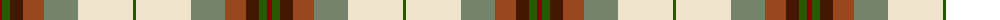
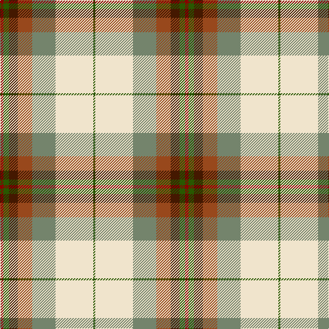

The parent of this is [Canadian Shield (Personal)](/tartans/dra/5/g8/dr13/t21/n34/w55/g/3/)

This was sourced from tartans-authority.  It is a [7 stripes tartan](/stripes/stripes7/).

Original link http://www.tartansauthority.com/tartan-ferret/display/7886/

## Thread count
DRa/5 G8 DR13 T21 N34 W55 G/3

## Palette
Each colour and its ΔE from the base-6 reference it is a variant of.

| Colour | Shade | Base | ΔE (OKLab) |
|---|---|---|---|
| DR |  `#441800` | B  | 0.22 |
| DRa |  `#880000` | R  | 0.14 |
| G |  `#285800` | G  | 0.04 |
| N |  `#74846C` | G  | 0.19 |
| T |  `#98481C` | R  | 0.11 |
| W |  `#F0E4CC` | W  | 0.05 |

# Sample pattern

ID: /variants/dra/5/g8/dr13/t21/n34/w55/g/3-dr441800-dra880000-g285800-n74846c-t98481c-wf0e4cc/
