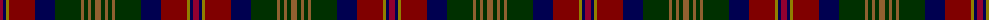

The parent of this is [Bonnie Brae](/tartans/dra/6/db3/lg3/dr26/db20/dg26/lt3/dg4/lt3/dg4/lt/6/)

This was sourced from weddslist.  It is a [11 stripes tartan](/stripes/stripes11/).

Original link http://www.weddslist.com/cgi-bin/tartans/pg.pl?source=sts

## Thread count
DRa/6 DB3 LG3 DR26 DB20 DG26 LT3 DG4 LT3 DG4 LT/6

## Palette
Each colour and its ΔE from the base-6 reference it is a variant of.

| Colour | Shade | Base | ΔE (OKLab) |
|---|---|---|---|
| DB |  `#000050` | B  | 0.20 |
| DG |  `#003000` | G  | 0.18 |
| DR |  `#800000` | R  | 0.16 |
| DRa |  `#900030` | R  | 0.13 |
| LG |  `#908000` | G  | 0.19 |
| LT |  `#906030` | R  | 0.15 |

ID: /variants/dra/6/db3/lg3/dr26/db20/dg26/lt3/dg4/lt3/dg4/lt/6-db000050-dg003000-dr800000-dra900030-lg908000-lt906030/
