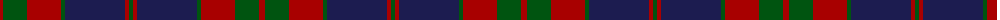
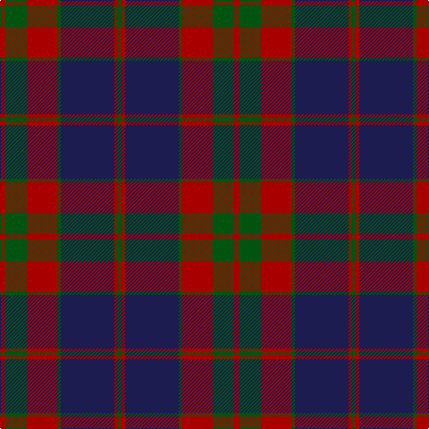

The parent of this is [Rannoch Moor (Fashion)](/tartans/dra/6/g24/dr24/dra10/g4/db60/dra4/g/4/)

This was sourced from tartans-authority.  It is a [8 stripes tartan](/stripes/stripes8/).

Original link http://www.tartansauthority.com/tartan-ferret/display/7273/

## Thread count
DRa/6 G24 DR24 DRa10 G4 DB60 DRa4 G/4

## Palette
Each colour and its ΔE from the base-6 reference it is a variant of.

| Colour | Shade | Base | ΔE (OKLab) |
|---|---|---|---|
| DB |  `#1C1C50` | B  | 0.14 |
| DR |  `#A80000` | R  | 0.07 |
| DRa |  `#A80000` | R  | 0.07 |
| G |  `#005410` | G  | 0.06 |

# Sample pattern

ID: /variants/dra/6/g24/dr24/dra10/g4/db60/dra4/g/4-db1c1c50-dra80000-draa80000-g005410/
