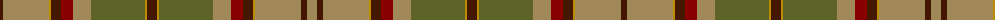

The parent of this is [Satisfashion Argyll](/tartans/dra/6/lt46/dy2/dra10/dr12/lt18/g54/dy2/dra10/dy2/g54/lt18/dr12/dra10/dy2/lt46/dra6/lt/10/)

This was sourced from register-of-tartans.  It is a [18 stripes tartan](/stripes/stripes18/).

Original link https://www.tartanregister.gov.uk/tartanDetails.aspx?ref=3658

## Thread count
DRa/6 LT46 DY2 DRa10 DR12 LT18 G54 DY2 DRa10 DY2 G54 LT18 DR12 DRa10 DY2 LT46 DRa6 LT/10

## Palette
Each colour and its ΔE from the base-6 reference it is a variant of.

| Colour | Shade | Base | ΔE (OKLab) |
|---|---|---|---|
| DR |  `#880000` | R  | 0.14 |
| DRa |  `#441800` | B  | 0.22 |
| DY |  `#BC8C00` | Y  | 0.16 |
| G |  `#5C6428` | G  | 0.09 |
| LT |  `#A08858` | Y  | 0.21 |

ID: /variants/dra/6/lt46/dy2/dra10/dr12/lt18/g54/dy2/dra10/dy2/g54/lt18/dr12/dra10/dy2/lt46/dra6/lt/10-dr880000-dra441800-dybc8c00-g5c6428-lta08858/
